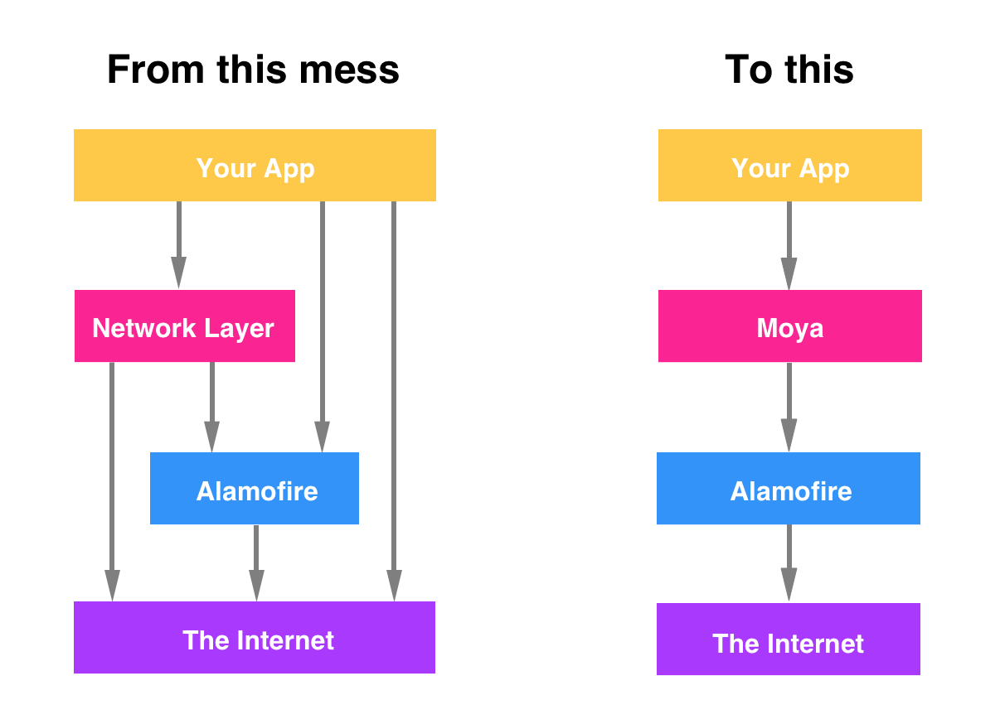

# MEINetwork

MEINetwork是移动中台项目iOS端实现网络功能的基础组件，它基于[Moya](https://github.com/Moya/Moya)实现，而Moya又基于著名的[Alamofire](https://github.com/Alamofire/Alamofire)实现。

不同于Alamofire的简单封装，Moya对于常见网络任务的封装，其高度的抽象及枚举的使用使得任务定制更加灵活，将项目中原本混乱的网络调用化繁为简。

下图为"简单Alamofire实现" vs "Moya实现"：



### 开始安装
1. CocoaPods

    本组件通过[CocoaPods](https://cocoapods.org)集成，集成前需要先安装CocoaPods。

2. 创建Podfile

    打开终端，cd到需要集成组件的工程项目主目录下，键入`pod init`创建Podfile文件。

3. 编辑Podfile

    ```ruby
    platform :ios, 10.0
    use_frameworks!

    target 'YOUR_PROJECT_TARGET' do
        # 目前直接使用Git地址引入
        pod 'MEINetwork', :git => 'http://10.25.81.246/maochaolong041/MEINetwork.git'
    end
    ```

4. 安装

    ```ruby
    pod install
    ```

### 开始使用
1. 创建自定义的基础TargetType

    通常建议开发人员创建一个基础的TargetType（继承自`CustomTargetType`），这样方便对项目中所有网络请求进行统一配置，示例代码如下：

    ```swift
    import MEINetwork

    protocol BaseTargetType: CustomTargetType {}

    extension BaseTargetType {

        var path: String {
            // 请求路径可留空，会被其子类实现所替换
            return ""
        }

        var appID: String {
            return "YOUR_APP_ID"
        }

        var deviceID: String {
            return "YOUR_DEVICE_ID"
        }

        var sessionID: String? {
            // 会话ID可留空，根据实际需求决定是否设置，常用于登录后相关请求场景
            return "YOUR_SESSION_ID"
        }

        var token: String? {
            // 请求令牌可留空，需要自己通过网络获取
            return "YOUR_TOKEN"
        }

        var salt: String {
            // 网络验签使用到的盐值，后端开发人员定义
            return "YOUR_SALT"
        }

        static var environment: NetworkEnvironment {
            // 网络环境，包括接口地址及网页地址两部分，参考`NetworkEnvironment.swift`
            return YOUR_ENVIRONMENT
        }

    }
    ```

2. 创建自定义的NetworkProvider（可选）

    在这一步中，我们将重写`NetworkProvider`中的`request(_:callbackQueue:progress:completion:)`函数，目的在于对网络请求返回值进行统一处理，如数据过滤操作，公共错误处理等。示例代码如下：

    ```swift
    import MEINetwork
    import Moya

    class TFNetworkProvider<Target: TargetType>: NetworkProvider<Target> {

        @discardableResult
        override func request(_ target: Target, callbackQueue: DispatchQueue? = .none,
                              progress: ProgressBlock? = .none,
                              completion: @escaping DictionaryCompletion) -> Cancellable {
            return super.request(target, callbackQueue: callbackQueue, progress: progress, completion: {
                if let error = $1 {
                    // TODO: 错误处理代码
                    // 执行回调
                    completion(nil, HANDLED_ERROR)
                } else if let json = $0 {
                    // TODO: 数据处理代码
                    // 执行回调
                    completion(HANDLED_DATA, nil)
                }
            })
        }
    }
    ```

3. 创建与实际网络请求相关的TargetType

    在这一步中，我们将用到第一步中创建的`BaseTargetType`，重写其中的方法以完成自定义需求。示例代码如下：

    ```swift
    import MEINetwork

    /// Token相关网络请求
    ///
    /// - token: Token获取
    enum TokenService {
        case token
    }

    extension TokenService: BaseTargetType {

        var path: String {
            return "token/generate-token"
        }

        var token: String? {
            // 令牌获取接口本身不需要传递令牌参数
            return nil
        }

    }
    ```

    > 注：通常情况下，每个业务模块中包含多个网络请求，这时候使用枚举来定义请求对象就非常直观方便，具体示例请参照"高级用法"。

4. 发起请求

    在这一步中，我们将正式发起网络请求。示例代码如下：

    ```swift
    import MEINetwork

    ...

    let provider = NetworkProvider<TokenService>(environment: TokenService.environment)

    provider.request(.token) {
        if let error = $1 {
            print(error.localizedDescription)
        } else if let data = $0?["data"] as? [String : Any],
                  let token = data["token"] as? String {
            print(token)
        } else {
            print($0?["resultMessage"] ?? "")
        }
    }

    ...
    ```

### 高级用法
1. 通过枚举传递请求参数

    在这一步中，我们将学会使用枚举来传递请求中需要的参数。示例代码如下：

    ```swift
    import MEINetwork
    import Moya

    /// 智库模块相关网络请求
    ///
    /// - instantList: 即时内参列表
    /// - monitoring: 监测预警
    /// - prejudge: 形式预判
    /// - customization: 定制智库
    enum TFAssistantService {
        case instantList(pageNumber: UInt, pageSize: UInt?)
        case monitoring(riskTypeCode: String)
        case prejudge(pageNumber: UInt, pageSize: UInt?)
        case customization(name: String, phone: String, requirements: String, favorites: [String], achievements: [String])
    }

    extension TFAssistantService: BaseTargetType {

        var path: String {
            switch self {
            case .instantList(_, _):
                return "today-finance-app/v2/think-tank/internal-news/list"
            case .monitoring(_):
                return "today-finance-app/v2/think-tank/monitor/home/info"
            case .prejudge(_, _):
                return "today-finance-app/v2/think-tank/prejudge/home/info"
            case .customization(_, _, _, _, _):
                return "today-finance-app/v2/think-tank/user-requirement/create"
            }
        }

        var method: Moya.Method {
            switch self {
            case .instantList(_, _):
                return .get
            case .monitoring(_):
                return .get
            case .prejudge(_, _):
                return .get
            case .customization(_, _, _, _, _):
                return .post
            }
        }

        var task: Task {
            switch self {
            case .instantList(let pageNumber, let pageSize):
                return .requestParameters(parameters: ["pageNumber": pageNumber, "pageSize": pageSize ?? 10], encoding: URLEncoding.queryString)
            case .monitoring(let riskTypeCode):
                return .requestParameters(parameters: ["riskTypeCode": riskTypeCode], encoding: URLEncoding.queryString)
            case .prejudge(let pageNumber, let pageSize):
                return .requestParameters(parameters: ["pageNumber": pageNumber, "pageSize": pageSize ?? 10], encoding: URLEncoding.queryString)
            case .customization(let name, let phone, let requirements, let favorites, let achievements):
                return .requestParameters(parameters: ["name": name, "phone": phone, "requirements": requirements, "favorites": favorites, "achievements": achievements], encoding: JSONEncoding.default)
            }
        }

    }
    ```

2. 设置HTTP方法

    在上一步示例代码中，我们使用到了`.get`和`.post`两种常用的HTTP方法，当然，根据[RFC7231](https://tools.ietf.org/html/rfc7231#section-4.3)文档，我们还可以设置对应的`.options`，`.head`，`.put`，`.patch`，`.delete`，`.trace`，`.connect`方法。

3. 设置Task

    在先前`TokenService`示例中，我们并没有重写`task`属性，这时他的默认task为`.requestPlain`，表明该请求不包含任何其他的参数或数据。在`TFAssistantService`示例中，为了设置请求参数，我们使用了`.requestParameters(parameters:encoding:)`来传递字典作为请求参数，同时需要注意的是不同的请求方法需要指定其编码方式，不然可能会导致服务器端无法对参数进行解码。此外，我们还可以定义其他类型Task，包括文件上传、文件下载、表单数据上传、复合数据传递等，具体定义请参考[Task.swift](https://github.com/Moya/Moya/blob/master/Sources/Moya/Task.swift)。

4. 其他用法

    除以上高级用法之外，还提供了数据mock、Status Code校验、自定义请求Header等操作，具体使用请参考[TargetType.swift](https://github.com/Moya/Moya/blob/master/Sources/Moya/TargetType.swift)。
